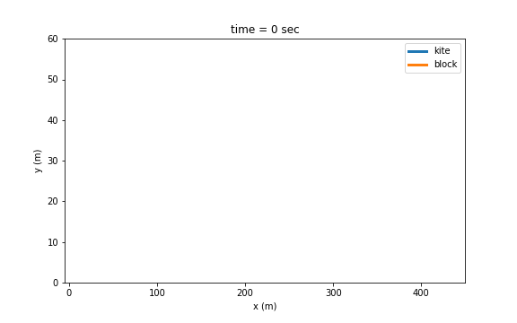

# Wind Energy Harvesting with Reinforcement Learning

This repository contains the implementation regarding the work on wind energy production by means of airborne technologies and reinforcement learning.

Until now, only the 2 dimensional model is studied.
* In the ```Dynamics``` folder you can find the 2D adn 3D dynamical models of an airborne device (kite) attached to the ground with a tether

* In the ```Learning``` folder you can find the implementation of the sarsa algorithm to perform the learning of the device

## Examples:

Trajectory of a kite pulling a block in a constant wind of 10 m/s along the x axis, with attack angle of 19 degrees and chord length fixed to 50 m. The kite was given an angular acceleration of 0.5 radians to start its fligth.

<figure>
  
</figure>


### Contributors:

- [Nicole Orzan](http://github.com/nicoleorzan)
- [Claudio Leone](https://github.com/LionClaude)
